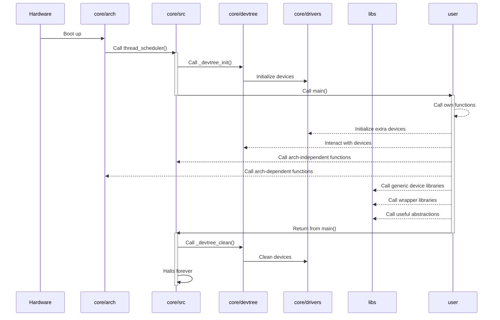

# Vermillion
A library operating system for unikernels

## Development status
Alpha, some core features are still not implemented.
Will support Orange Pi One (armv7) and x86-32 pcs (i686) at first.

## Dependencies
You may need the following packages, which are necessary to build the
cross-compiler, install the bootloader, go through the compilation
process and debug the resulting image
```sh
gcc make git rsync g++ bison flex texinfo libncurses-dev
kconfig-frontends moreutils swig python3-dev bc
u-boot-tools grub2-common xorriso dialog mtools
qemu-system-arm qemu-system-i386 gdb-multiarch
```

## Example
~/my\_project/main.c:
```c
#include <general/types.h>

#include <hal/base/dev.h>
#include <hal/classes/gpio.h>

#include <system/log.h>

dev_incl (gpio, gpio0)

extern void
main(void)
{
    log("Hello World!\r\n");

    gpio_config(&dev(gpio0), 13, GPIO_OUT, GPIO_PULLOFF);
    gpio_set(&dev(gpio0), 13, true);
}
```

The image will be created in build/
```sh
. export.sh

cd ~/my_project
vmake defconfig
OBJS='main.o' vmake all
vmake debug
```

For testing
```sh
cd test
./test.sh
```

## Topology

