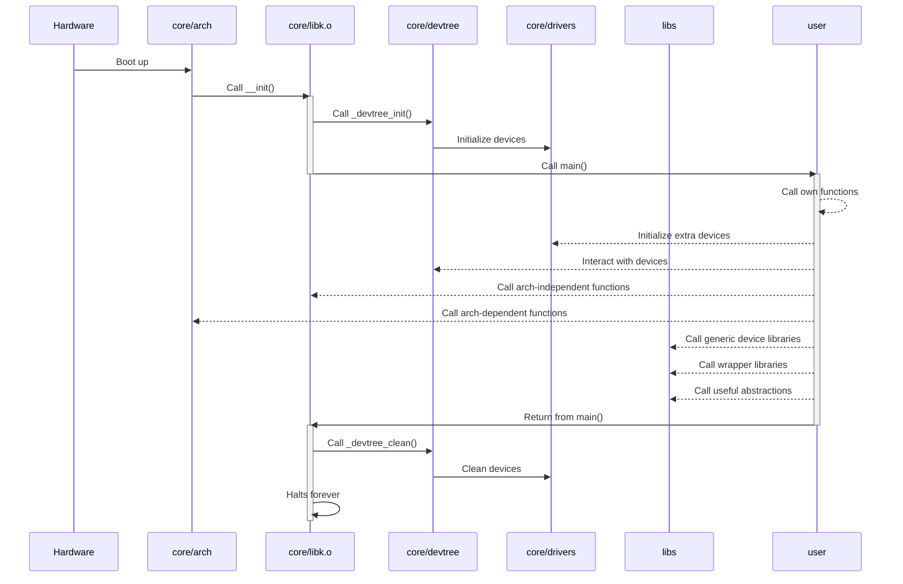

# Vermillion
A library operating system for unikernels

## Supported boards
Currently focused on Orange Pi One (armv7), supports i686
for arch dependency tests

## Dependencies
You may need the following packages, which are necessary to build the
cross-compiler, install the bootloader, go through the compilation
process and debug the resulting image
```sh
gcc make git rsync g++ bison flex texinfo libncurses-dev
kconfig-frontends moreutils swig python3-dev bc
u-boot-tools grub2-common xorriso dialog mtools
qemu-system-arm qemu-system-i386 gdb-multiarch
```

## Example
~/my\_project/main.c:
```c
#include <easy/io.h>

#include <core/types.h>
#include <core/utils.h>

#include <core/dev.h>
dev_incl (gpio, gpio0)

extern void
main(void)
{
    log_s("Hello World!\r\n");

    io_chip(&dev(gpio0));
    io_config(13, OUTPUT);
    io_write(13, HIGH);
}
```

The image will be created in build/
```sh
. export.sh

cd ~/my_project
vmake defconfig
OBJS='main.o' LIBS='easy' vmake all
vmake debug
```

For testing
```sh
. export.sh

cd test
vmake defconfig
OBJS='libk.o' vmake all
vmake debug
```

## Missing features before first release
- core/libk.o
    - Software interrupt handling
- libs (Generic device libraries)
    - Sound (audio drivers)
    - Storage (fs drivers)
- libs (Wrappers libraries)
    - Libc wrapper

## Topology

